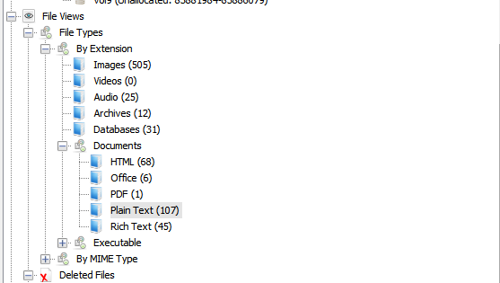
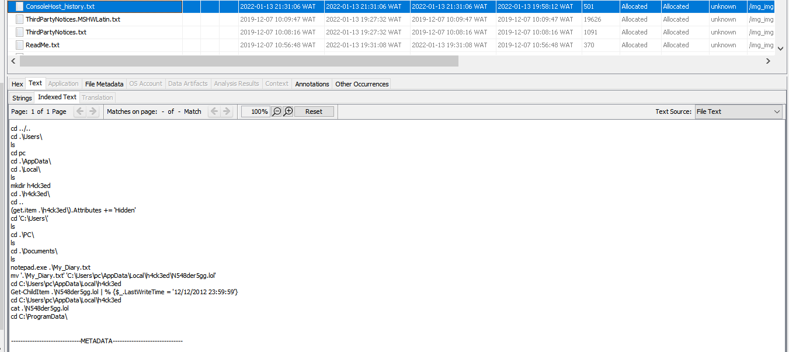
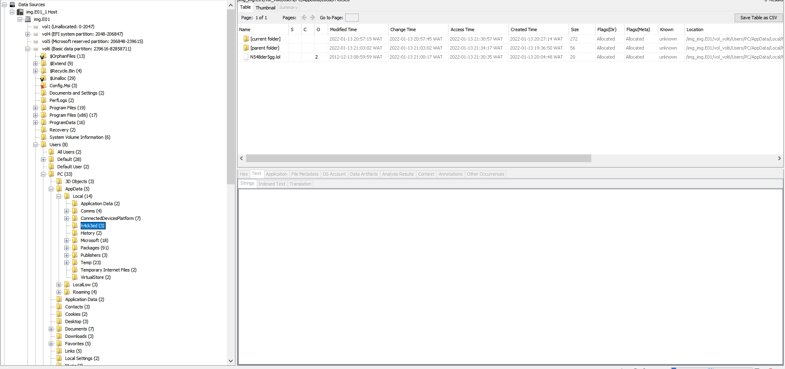
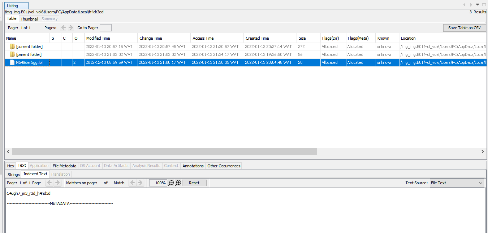

# TakeOver

## Write-up

Using `Autopsy` we can open the system image and start investigating.  
On Windows the history of all the exectuted commands are stored inside a file called `ConsoleHost_history.txt`, since it's a text file we can access it through:
```
File Views -> Documents -> Plain Text
```


Now we see that the hacker created the folder `h4ck3ed` then opened the file `My_Diary.txt` , renamed it into `N548der5gg.lol`, changed the last write date to `12-12-2012-23:59:59`.  



Let's check out the file content:





File content: `C4ugh7_m3_r3d_h4nd3d`
## Flag

`shellmates{My_Diary.txt_N548der5gg.lol_12-12-2012-23:59:59_notepad.exe_C4ugh7_m3_r3d_h4nd3d}`
