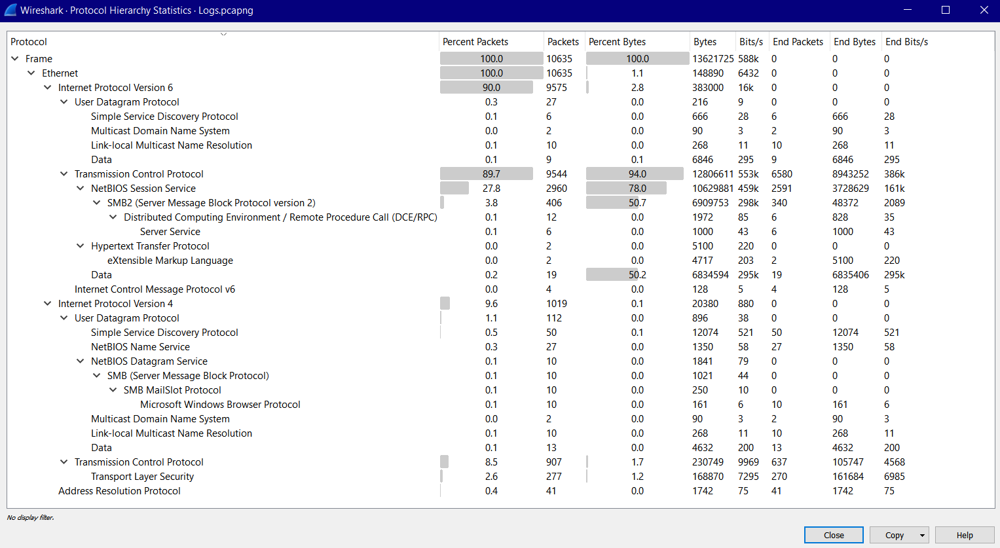
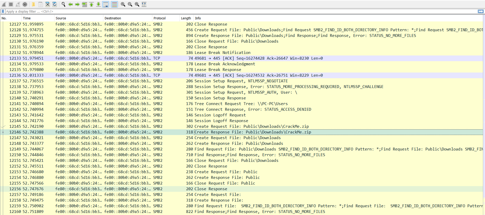
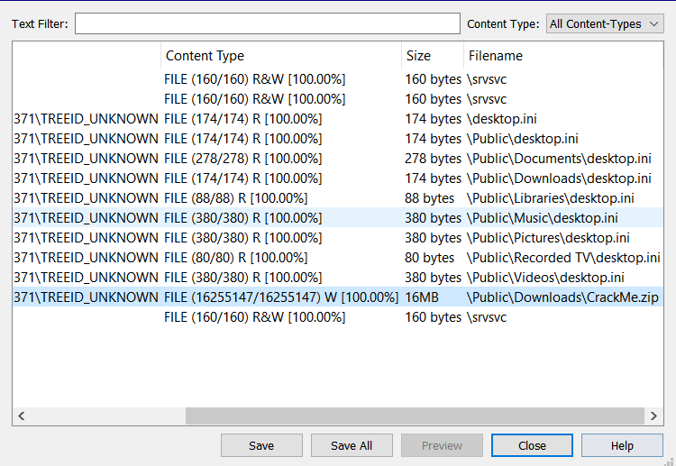
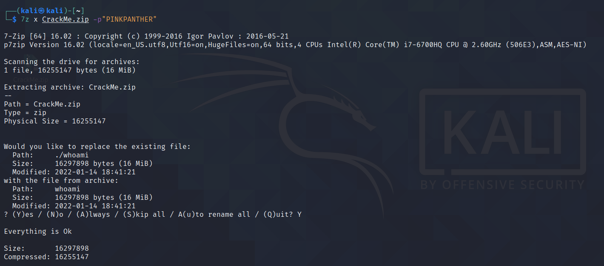
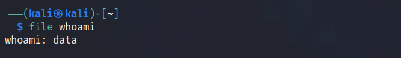

# The Pursuit

## Write-up
### 1- check Statistics 

`Statistics` -> `Protocol hierarchy`



There is some specious SMB traffic, let's check it out by filtering `smb2` packets



Well! someone is transferring files !

### 2- Extract the files
Go to `File` -> `Export Objects` -> `SMB..`



there is a ```zip``` compressed file, select then save.

### 3- Crack the ZIP file

- the file is a password protected ZIP, `zip2john` will do the job! 
- Next, lets convert it to `JtR`’s cracking format

```console
zip2john CrackMe.zip > Crackme.zip.hash

```
- Attack! using the Dictionary: `rockyou.txt`

```console
john --wordlist=/usr/share/wordlists/rockyou.txt Crackme.zip.hash
```

  


Password : `PINKPANTHER`

- Extract Files..

```console
7z x CrackMe.zip -p"PINKPANTHER"
```


output files: `whoami`
### 4- Bringing out the evidence
- analyze the file

```console
file whoami
```

- check for some hidden files with `binwalk`

```console
binwalk --dd='.*' whoami
```


Here we are ! 


## Flag

`shellmates{Y0U_w0n_th3_pur5u1t}`
