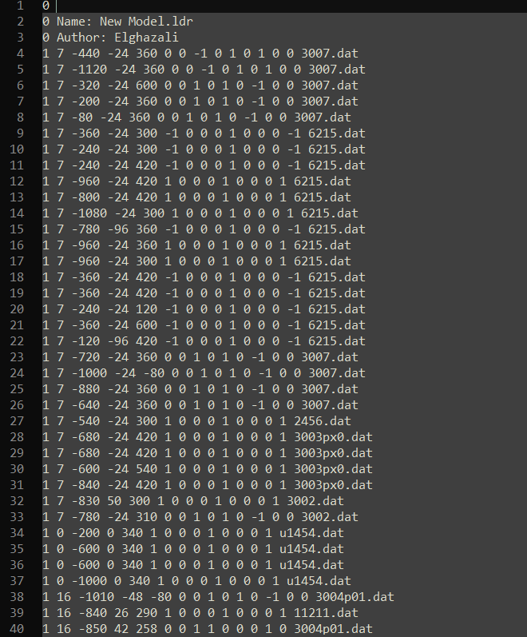
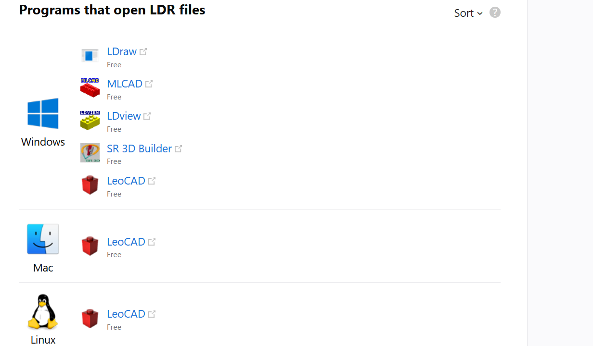
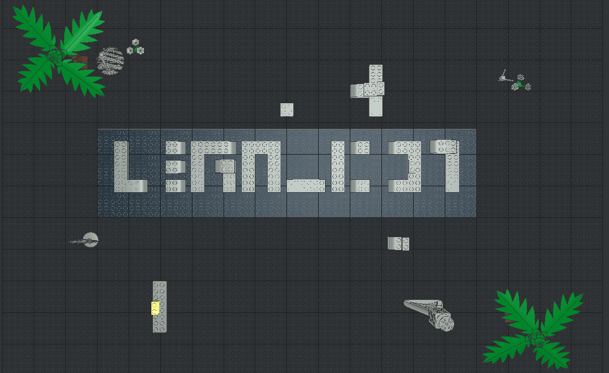
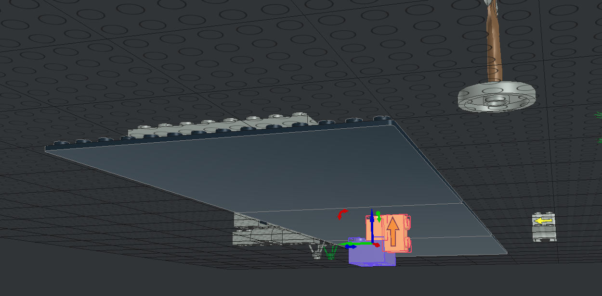
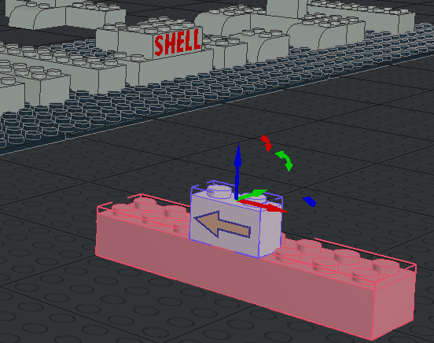
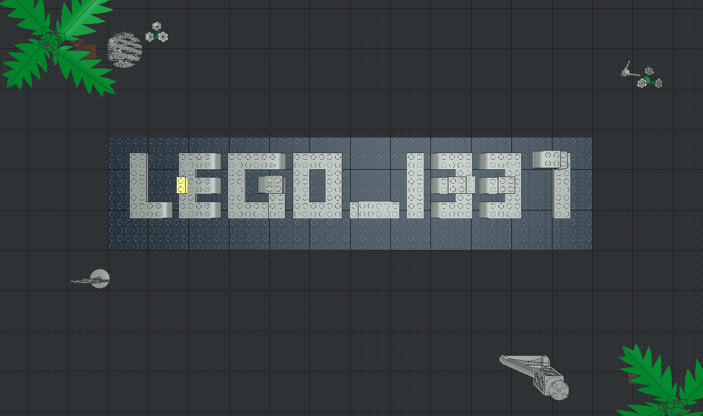

# LeoGo

## Write-up
**1. inspect the file content:**

the file extension is ``.ldr``

**2. Google: LDR file extension**

there is a hint in the Challenge name to use ``LeoCAD``

**3. Start Building**

Let's start fixing the missed parts.
Some bricks contains an arrow to make things easier!

## Flag

`shellmates{LEGO_1337}`
