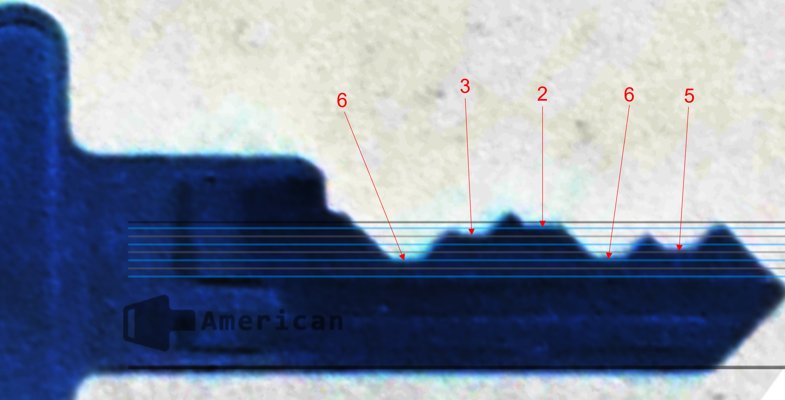

# Keys to the Kingdom

## Write-up

It should be obvious that the person we're talking about in the challenge is the author himself.  
We will find a picture containing a keyring in his Facebook profile.  

The challenge mentioned that it's the biggest key, so it's easy to find out that the key in question is the American Lock one.  

By zooming in and using Deviant's [key decoding chart](https://raw.githubusercontent.com/deviantollam/decoding/master/Key%20Decoding/Decoding%20-%20American.png) for American Lock, we recover the key bittings.

## Flag

`shellmates{AMERICANLOCK-63265}`
